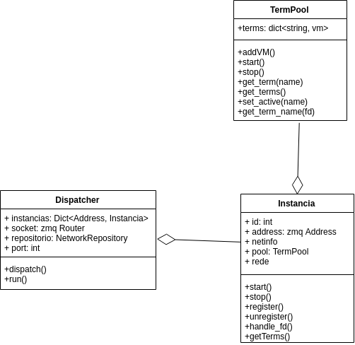

# NkZMQ2 - Laboratorio Virtual de Redes - vNet 

## Introdução:
  O emulador de redes Netkit2 apresenta-se como um ambiente para experimentos com redes de computadores, para torna-lo mais acessível, este projeto propõe estendê-lo para que seja executado em um servidor de aplicação, ou mesmo em nuvem, sendo acessado através de uma interface web. Nesse modelo, chamado de vNet, estudantes podem criar, executar e investigar suas redes, que podem ficar ativas e operantes pelo tempo que for necessário. O novo serviço possui também um catálogo de experimentos e a possibilidade de interligar redes de diversos experimentos. O vNet assim facilitaria a experimentação com redes de computadores e a criação de aulas práticas em cursos de redes em modalidade EaD.

## Netkit2: 
  Netkit2 é um ambiente para experimentos com redes de computadores desenvolvido pela Área de Telecomunicações do IFSC (Câmpus São José), e que se inspirou no Netkit[1], uma ferramenta semelhante (mas mais simplificada) desenvolvida pela Universidade de Roma, na Itália.
  Ele se compõe de máquinas virtuais Linux (implementadas com kernel Linux UML – User Mode Linux)[2], que funcionam como roteadores ou computadores, e hubs Ethernet virtuais (UML switch) para interligar as máquinas virtuais. Para todos os efeitos, cada máquina virtual funciona como se fosse um computador real, possuindo uma ou mais interfaces de rede. Com esses recursos é possível criar redes de configurações arbitrárias para estudar protocolos de comunicação e serviços de rede.
  
As principais diferenças entre o Netkit e o Netkit2 são: 
* A definição de tipos de equipamentos a serem usados no experimento, tais como roteadores, switches, e computadores de uso geral: cada máquina virtual pode assim ser especializada para facilitar sua configuração.
  
* A possibilidade de definir diversos parâmetros de configuração de rede (ex: endereços de interfaces, rotas, VLANs, ...) diretamente no arquivo de configuração de um experimento.
  
* A possibilidade de criar enlaces ponto-a-ponto via links seriais virtuais, que podem ter configurados suas taxas de bits, taxas de erro (BER) e atraso de propagação.
  
* Uma interface gráfica para a execução de experimentos. Esse aplicativo concentra as telas de terminal das máquinas virtuais e provê diversas funções auxiliares para ajudar na realização dos experimentos. A figura abaixo mostra um exemplo dessa interface em ação:

## Estrutura do projeto
Dividido em duas partes, cliente (Client2.py) e Servidor (Server2.py), além do repositório de redes. 
Para execução deve-se em uma máquina executar o Servidor e em outra o cliente, obviamente do lado do cliente deve-se alterar o ip para o ip do servidor. 

## Servidor: 
No lado do servidor usa-se, as classes: 
* TermPool: Agrupador de terminais. 
* Instancia: Representa uma instancia em execução 
* Dispatcher: gerencia as instancias 

O diagrama a seguir é um breve representação do lado do servidor. 

* Para obter a documentação da classe: pydoc3 server2

## Message: 
Protocolo criado para a comunicação entre servidor e cliente, todas as mensagens trocadas entre eles o utilizam. 
Formatos das mensagens recebidas do cliente: (cmd, data)
Formatos das mensagens recebidas do servidor: (status, data) 

* para obter a documentação da classe: pydoc3 nkmessage

## Cliente:
Gerencia as redes de um catalogo (podendo adicionar, remover e atualizar), além de criar e inicializar 
os pseudos terminais. 

* O diagrama a seguir demonstra de forma extremamente simplificada a interação entre ambas partes. 

## Referencias: 
[1] http://wiki.netkit.org/index.php/Main_Page

[2] http://user-mode-linux.sourceforge.net/
